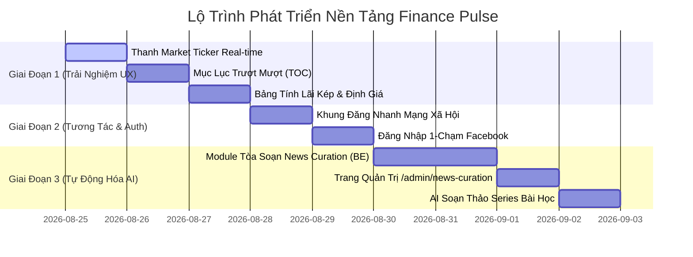

# 🚀 LỘ TRÌNH PHÁT TRIỂN & CÁC CHỨC NĂNG CẦN BỔ SUNG (FEATURE ROADMAP)
# Finance Pulse & Community Platform

Tài liệu này lưu trữ toàn bộ các tính năng, nâng cấp trải nghiệm người dùng (UX) và module công nghệ cần bổ sung để hoàn thiện website thành một nền tảng **Cổng thông tin & Mạng xã hội Tài chính Toàn diện**.

---

## 📌 TỔNG HỢP 8 TÍNH NĂNG TRỌNG TÂM

```text
┌────┬───────────────────────────────────────────┬─────────────┬───────────────────────────┐
│ STT│ Tên Tính Năng                             │ Mức Độ Ưu   │ Phạm Vi (Scope)           │
│    │                                           │ Tiên        │                           │
├────┼───────────────────────────────────────────┼─────────────┼───────────────────────────┤
│ 1  │ 🔴 Thanh Chỉ Số Thị Trường Real-Time      │ ⚡ Cao      │ Backend + Frontend Header │
│ 2  │ 📜 Mục Lục Trượt Mượt (Table of Contents) │ ⚡ Cao      │ Frontend Post Detail      │
│ 3  │ 🧮 Bảng Tính Lãi Kép & Định Giá Cổ Phiếu  │ ⚡ Cao      │ Frontend Interactive Tool │
│ 4  │ ⚡ Khung Đăng Nhanh Mạng Xã Hội           │ ⭐ Trung    │ Frontend + Backend Feed   │
│ 5  │ 🤖 Tòa Soạn Tin Tức Tự Động (AI Newsroom) │ 💎 Cốt lõi  │ Backend News Curation     │
│ 6  │ 🔵 Đăng Nhập 1-Chạm Bằng Facebook         │ ⭐ Trung    │ Auth Module (FE + BE)     │
│ 7  │ 🗂️ Phân Định Rạch Ròi 3 Loại Nội Dung    │ 💎 Đã xong  │ Backend Schema & UI Feed  │
│ 8  │ 🎓 AI Soạn Thảo Series Bài Học Tài Chính  │ ⭐ Trung    │ AI Studio & Series Engine │
└────┴───────────────────────────────────────────┴─────────────┴───────────────────────────┘
```

---

## 📝 CHI TIẾT TỪNG TÍNH NĂNG

### 1. 🔴 Thanh Chỉ Số Thị Trường Thời Gian Thực (Real-Time Market Ticker Bar)
* **Mục tiêu**: Hiển thị bảng điện tử mini chạy trên đỉnh Header, cập nhật giá liên tục mỗi **15–30 giây**.
* **Dữ liệu hiển thị**:
  * **Chứng khoán VN**: VN-Index, VN30, FPT, VCB, HPG (lấy qua Open API sàn chứng khoán).
  * **Crypto**: Bitcoin (BTC/USD), Ethereum (ETH/USD) (lấy qua Binance Public API miễn phí 100%).
  * **Tỷ giá & Hàng hóa**: Vàng SJC, Tỷ giá USD/VND (lấy qua Vietcombank/SJC feed).
* **Hiệu ứng UX**:
  * Nhấp nháy màu **Xanh lá** khi giá tăng, màu **Đỏ** khi giá giảm, màu **Vàng** khi tham chiếu.
  * Tự động làm mới bằng `refetchInterval` mà không cần reload trang.

---

### 2. 📜 Mục Lục Thông Minh & Trượt Mượt (Interactive Table of Contents 1 đến 10)
* **Mục tiêu**: Tối ưu trải nghiệm đọc cho các bài viết dài, bài phân tích chuyên sâu (như bài về Lãi kép, 10 nguyên tắc đầu tư...).
* **Cơ chế hoạt động**:
  * Tự động quét và bóc tách các thẻ Heading `H2`, `H3` trong bài viết (Mục `1.` đến `10.`).
  * Hiển thị ở **Đầu bài viết** và **Thanh bên cố định (Sticky Sidebar)** đi theo khi cuộn chuột.
  * Khi người đọc bấm vào bất kỳ mục nào ➡️ Giao diện **trượt mượt mà (smooth scroll)** xuống đúng vị trí đó.
  * **Scroll Spy**: Tự động sáng đèn/highlight mục lục theo vị trí người đọc đang cuộn tới.

---

### 3. 🧮 Bảng Tính Lãi Kép & Định Giá Cổ Phiếu Tương Tác (Financial Lead Magnets)
* **Mục tiêu**: Tạo công cụ giữ chân người dùng lâu trên website và dễ viral trên mạng xã hội (Facebook, TikTok, Threads).
* **Công cụ 1: Bảng tính Lãi kép & Kế hoạch Nghỉ hưu (Compound Interest Calculator)**:
  * Áp dụng **công thức Toán tài chính chuẩn quốc tế**:
    $$A = P \left(1 + \frac{r}{12}\right)^{12t} + PMT \times \frac{\left(1 + \frac{r}{12}\right)^{12t} - 1}{\frac{r}{12}}$$
  * Thanh trượt (Slider): Vốn ban đầu ($P$), Tích lũy mỗi tháng ($PMT$), Lãi suất kỳ vọng ($r$), Số năm ($t$).
  * Vẽ biểu đồ trực quan so sánh **Tổng Tiền Gốc** vs **Tiền Lãi sinh sôi từ Lãi Kép**.
  * Bảng chi tiết dòng tiền từng năm (Năm 1 đến Năm 20).
* **Công cụ 2: Định giá nhanh Cổ phiếu (Quick Valuation Tool)**:
  * Định giá theo mô hình P/E Multiples & Chiết khấu cổ tức Gordon.
  * Tính toán **Vùng giá mua an toàn (Margin of Safety - Chiết khấu 20%)**.

---

### 4. ⚡ Khung Đăng Bài Nhanh Mạng Xã Hội (Quick Social Composer)
* **Mục tiêu**: Xóa bỏ cảm giác "nặng nề như đang gõ văn bản Word" khi muốn đăng tin nhanh.
* **Cơ chế hoạt động**:
  * Đặt ô soạn thảo nhanh ngay trên đầu Trang chủ: *"Hôm nay bạn quan sát mã cổ phiếu nào?"*.
  * Người dùng/Admin chỉ cần gõ 2-3 câu nhận định nhanh, gắn mã ticker (`$FPT`, `$VNINDEX`), đính kèm 1 ảnh chart.
  * Bấm **"Đăng ngay"** (thời gian đăng chỉ mất 5–10 giây).
  * Hiển thị dạng Card mạng xã hội có Avatar to, Rank uy tín, nút Upvote và Comment thảo luận.

---

### 5. 🤖 Hệ Thống Tòa Soạn Tin Tức Tự Động (`news-curation`)
* **Mục tiêu**: Tự động hóa 100% quy trình cào tin và dùng AI viết lại tin tức tài chính hằng ngày.
* **Cơ chế hoạt động**:
  * **Thu thập Lai (Hybrid)**: Quét RSS Feeds định kỳ (`06:30`, `11:30`, `17:30`) từ CafeF, Vietstock, VnEconomy + Dùng Cheerio/Readability bóc tách toàn văn thân bài và ảnh gốc.
  * **Lọc trùng lặp (Deduplication)**: 5 tầng kiểm tra chống cào trùng; gom tin cùng 1 sự kiện.
  * **Gemini 2.5 Flash Rewriter**: Bóc tách số liệu thị trường (`NEWS_ANALYSIS_TEMPLATE`), viết lại bài hoàn toàn mới theo văn phong tài chính khách quan, súc tích, có Sapo và H2.
  * **Quick URL Import**: Ô dán link bài báo bất kỳ trên Web ➡️ AI tự bóc tách và viết nháp sau 3 giây.
  * **Trang Quản trị `/admin/news-curation`**: Lưu bản nháp `status = 'DRAFT'` để BTV duyệt bằng **1-Click** xuất bản lên Trang chủ.

---

### 6. 🔵 Đăng Nhập 1-Chạm Bằng Facebook (Facebook OAuth Login)
* **Mục tiêu**: Giúp người dùng Việt Nam đăng ký và gia nhập cộng đồng chỉ trong 1 cú click.
* **Cơ chế hoạt động**:
  * Frontend: Nút **"Tiếp tục với Facebook"** ([FacebookAuthButton.tsx](file:///d:/tools/finance-community/apps/web/components/auth)) đặt cạnh nút Google.
  * Backend: Endpoint `POST /api/v1/auth/facebook` xác thực token với Facebook Graph API, tự động tạo tài khoản trong PostgreSQL và cấp phát JWT Token.

---

### 7. 🗂️ Phân Định Rạch Ròi 3 Loại Nội Dung trên Hệ Thống (Đã nâng cấp Schema)
* **`NEWS` (Tin tức thị trường)**: Tin do AI cào & BTV duyệt ➡️ Lên dải tin nổi bật `DailyNewsStrip` và thanh tin chạy `MacroNewsTicker`.
* **`SERIES` (Khóa học / Chuyên đề)**: Bài học kiến thức tài chính dài kỳ ➡️ Lên mục lục `/series` và `FeaturedSeriesWidget`.
* **`COMMUNITY` (Bài viết thành viên)**: Nhận định, hỏi đáp của người dùng ➡️ Lên Bảng tin Cộng đồng (Community Feed).

---

### 8. 🎓 AI Trợ Lý Soạn Thảo Series Bài Học (`content` / `series-ai`)
* **Mục tiêu**: Hỗ trợ BTV tạo các chuỗi khóa học tài chính bài bản (F0 đến Chuyên nghiệp).
* **Cơ chế hoạt động**:
  * **Lập giáo trình tự động**: Nhập chủ đề ➡️ Gemini sinh khung 6–8 bài học logic.
  * **Soạn chi tiết bài học**: Tự động viết theo cấu trúc sư phạm (*Mục tiêu ➡️ Khái niệm ➡️ Case study thực tế cổ phiếu VN ➡️ Bảng biểu ➡️ Câu hỏi ôn tập*).

---

## 📅 LỘ TRÌNH THỰC HIỆN ĐỀ XUẤT


