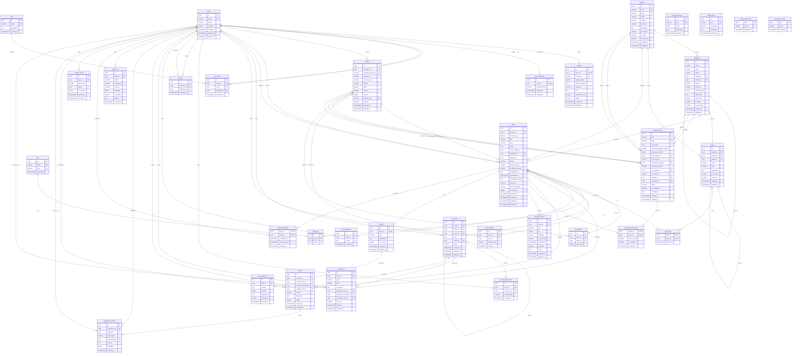

# Sơ đồ quan hệ cơ sở dữ liệu

Sơ đồ dựng từ các khóa ngoại khai báo trong schema backend. Gồm 34 bảng; trường không có FK khai báo được thể hiện riêng.

```mermaid
erDiagram
    users {
        uuid id PK
        varchar email UK
        varchar status
        varchar provider
        timestamptz created_at
        timestamptz updated_at
        timestamptz deleted_at
    }
    profiles {
        uuid id PK
        uuid user_id FK, UK
        varchar username UK
        varchar display_name
        uuid avatar_media_id
        varchar avatar_url
        text bio
        integer reputation_score
        varchar badge
        timestamptz created_at
        timestamptz updated_at
    }
    auth_credentials {
        uuid id PK
        uuid user_id FK,UK
        varchar password_hash
        timestamptz created_at
        timestamptz updated_at
    }
    roles {
        uuid id PK
        varchar name UK
        text description
        timestamptz created_at
    }
    user_roles {
        uuid id PK
        uuid user_id FK
        uuid role_id FK
        uuid assigned_by FK
        timestamptz assigned_at
    }
    domains {
        uuid id PK
        varchar code UK
        varchar slug UK
        varchar name
        varchar name_vi
        varchar name_en
        text description
        integer sort_order
        boolean is_active
        boolean is_promoted
        timestamptz created_at
        timestamptz updated_at
    }
    categories {
        uuid id PK
        varchar name
        varchar slug
        varchar scope
        uuid domain_id FK
        uuid parent_id FK
        varchar name_vi
        varchar name_en
        jsonb content_types
        text description
        integer sort_order
        boolean is_active
        boolean is_promoted
        timestamptz created_at
        timestamptz updated_at
    }
    topics {
        uuid id PK
        uuid domain_id FK
        uuid category_id FK
        uuid parent_id FK
        varchar name
        varchar slug
        text description
        integer sort_order
        boolean is_active
        timestamptz created_at
        timestamptz updated_at
    }
    tags {
        uuid id PK
        varchar name UK
        varchar slug UK
        timestamptz created_at
    }
    media {
        uuid id PK
        uuid uploader_id FK
        varchar cloudinary_public_id UK
        varchar secure_url
        varchar resource_type
        varchar format
        integer width
        integer height
        integer file_size
        varchar content_hash UK
        varchar purpose
        timestamptz created_at
        timestamptz deleted_at
    }
    posts {
        uuid id PK
        uuid author_id FK
        varchar content_type
        varchar title
        varchar slug
        text body
        uuid cover_media_id FK
        uuid category_id FK
        uuid domain_id FK
        varchar status
        varchar editorial_status
        varchar moderation_status
        uuid moderated_by FK
        timestamptz moderated_at
        text moderation_reason
        varchar meta_title
        varchar meta_description
        integer view_count
        timestamptz published_at
        timestamptz created_at
        timestamptz updated_at
        timestamptz deleted_at
    }
    post_tags {
        uuid id PK
        uuid post_id FK
        uuid tag_id FK
    }
    post_topics {
        uuid post_id PK,FK
        uuid topic_id PK,FK
        timestamptz created_at
    }
    post_media {
        uuid id PK
        uuid post_id FK
        uuid media_id FK
        integer sort_order
    }
    comments {
        uuid id PK
        uuid post_id FK
        uuid author_id FK
        uuid parent_id FK
        text body
        uuid media_id FK
        varchar status
        timestamptz created_at
        timestamptz updated_at
        timestamptz deleted_at
    }
    post_reactions {
        uuid id PK
        uuid user_id FK
        uuid post_id FK
        varchar reaction_type
        timestamptz created_at
    }
    comment_reactions {
        uuid id PK
        uuid user_id FK
        uuid comment_id FK
        varchar reaction_type
        timestamptz created_at
    }
    follows {
        uuid id PK
        uuid follower_id FK
        uuid following_id FK
        timestamptz created_at
    }
    post_bookmarks {
        uuid id PK
        uuid user_id FK
        uuid post_id FK
        timestamptz created_at
    }
    notifications {
        uuid id PK
        uuid user_id FK
        varchar type
        varchar title
        text message
        uuid reference_post_id FK
        uuid reference_comment_id FK
        uuid reference_user_id FK
        boolean is_read
        timestamptz read_at
        timestamptz created_at
    }
    reports {
        uuid id PK
        uuid reporter_id FK
        uuid reported_post_id FK
        uuid reported_comment_id FK
        uuid reported_user_id FK
        varchar reason
        text description
        varchar status
        timestamptz created_at
        timestamptz resolved_at
    }
    moderation_actions {
        uuid id PK
        uuid moderator_id FK
        uuid report_id FK
        varchar action_type
        uuid target_user_id FK
        text reason
        jsonb metadata
        timestamptz created_at
    }
    audit_logs {
        uuid id PK
        uuid actor_id FK
        varchar action
        varchar entity_type
        varchar entity_id
        jsonb metadata
        varchar ip_address
        text reason
        timestamptz created_at
    }
    system_settings {
        uuid id PK
        varchar key UK
        jsonb value
        text description
        timestamptz updated_at
    }
    feature_flags {
        uuid id PK
        varchar key UK
        boolean is_enabled
        text description
        timestamptz updated_at
    }
    learning_series {
        uuid id PK
        varchar title
        varchar slug UK
        text description
        integer estimated_duration_minutes
        jsonb learning_outcomes
        uuid hero_media_id FK
        varchar hero_alt_text
        uuid outcomes_media_id FK
        varchar outcomes_alt_text
        uuid cta_media_id FK
        varchar cta_alt_text
        uuid domain_id FK
        uuid category_id FK
        varchar status
        boolean is_published
        uuid created_by
        timestamptz created_at
        timestamptz updated_at
    }
    learning_series_posts {
        uuid series_id PK, FK
        uuid post_id PK, FK
        integer lesson_order
        boolean is_required
        timestamptz created_at
    }
    learning_sources {
        uuid id PK
        uuid post_id FK
        varchar title
        varchar url
        varchar publisher
        varchar source_type
        timestamptz checked_at
        boolean is_public
        text notes
        timestamptz created_at
        timestamptz updated_at
    }
    quizzes {
        uuid id PK
        uuid post_id FK, UK
        varchar title
        text description
        integer sort_order
        timestamptz created_at
        timestamptz updated_at
    }
    quiz_questions {
        uuid id PK
        uuid quiz_id FK
        text prompt
        jsonb options
        text explanation
        integer sort_order
        timestamptz created_at
    }
    learning_progress {
        uuid user_id PK, FK
        uuid post_id PK, FK
        timestamptz completed_at
        timestamptz last_viewed_at
        timestamptz updated_at
    }
    refresh_tokens {
        uuid id PK
        uuid user_id FK
        varchar token_hash
        uuid family
        boolean is_revoked
        timestamptz expires_at
        timestamptz created_at
    }
    page_views_daily {
        date day PK
        integer views
        timestamptz updated_at
    }
    post_views_daily {
        date day PK
        integer views
        timestamptz updated_at
    }

    users ||--o| profiles : profile
    users ||--o| auth_credentials : credentials
    users ||--o{ user_roles : has
    users o|--o{ user_roles : assigns
    roles ||--o{ user_roles : assigned
    users ||--o{ media : uploads
    users ||--o{ posts : authors
    users o|--o{ posts : moderates
    users ||--o{ comments : writes
    users ||--o{ post_reactions : reacts
    users ||--o{ comment_reactions : reacts
    users ||--o{ follows : follower
    users ||--o{ follows : following
    users ||--o{ post_bookmarks : saves
    users ||--o{ notifications : receives
    users o|--o{ reports : reports
    users ||--o{ moderation_actions : moderates
    users ||--o{ audit_logs : acts
    users ||--o{ learning_progress : progresses
    users ||--o{ refresh_tokens : owns
    users o|--o{ reports : reported_user
    users o|--o{ moderation_actions : target_user
    users o|--o{ notifications : reference_user

    domains ||--o{ categories : contains
    domains ||--o{ topics : contains
    domains ||--o{ posts : classifies
    domains ||--o{ learning_series : groups
    categories o|--o{ categories : parent
    categories o|--o{ topics : groups
    categories o|--o{ posts : classifies
    categories ||--o{ learning_series : classifies
    topics o|--o{ topics : parent

    media o|--o{ posts : cover
    media o|--o{ comments : attachment
    media ||--o{ post_media : attached
    posts ||--o{ post_media : has
    posts ||--o{ post_tags : tagged
    tags ||--o{ post_tags : used
    posts ||--o{ post_topics : categorized
    topics ||--o{ post_topics : used
    posts ||--o{ comments : has
    comments o|--o{ comments : replies
    comments ||--o{ comment_reactions : receives
    posts ||--o{ post_reactions : receives
    posts ||--o{ post_bookmarks : saved

    posts o|--o{ notifications : referenced
    comments o|--o{ notifications : referenced
    posts o|--o{ reports : reported
    comments o|--o{ reports : reported
    reports o|--o{ moderation_actions : action

    media o|--o{ learning_series : hero_media
    media o|--o{ learning_series : outcomes_media
    media o|--o{ learning_series : cta_media
    domains ||--o{ learning_series : domain
    categories ||--o{ learning_series : category
    learning_series ||--o{ learning_series_posts : contains
    posts ||--o{ learning_series_posts : lesson
    posts ||--o{ learning_sources : sources
    posts ||--o| quizzes : quiz
    quizzes ||--o{ quiz_questions : questions
    posts ||--o{ learning_progress : progress
```
